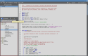
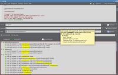

# mksv3

###Code editor

* **User friendly.** Intuitive interface. Works out of the box. You don't have to read a lot of docs
* **Hacker friendly**. Code as quickly as possible. Without mouse.
* **Minimalistic interface**. Screen is used for code, not for bells and whistles.
* **High quality**. No long list of fancy features. But, what is done, is done well.
* **Extensible.** Missing feature or language support? Don't create a new IDE, create a plugin

See [Features](features.html) and [Why new code editor?](why-new.html)
    
<table frame="void">
    <tr>
        <td width="20%">
            
            UI
        </td>
        <td width="20%">
            
            Minimalistic UI
        </td>
        <td width="20%">
            
            Search
        </td>
        <td width="20%">
            
            Good bye sed
        </td>
        <td width="20%">
            
            Markdown live preview
        </td>
    </tr>
</table>

mksv3 is **crossplatform**, but, currently has been tested only on Linux. Team will be appreciate you, if you shared your experience about other platforms.

The project is licensed under **GNU GPL v2** license

## Blog


  {{ post.date | date_to_string }}
  <a href="{{ page.root }}{{ post.url }}">{{ post.title }}</a>
  
{{ post.excerpt }}



<a href="archive.html">Archives</a>
