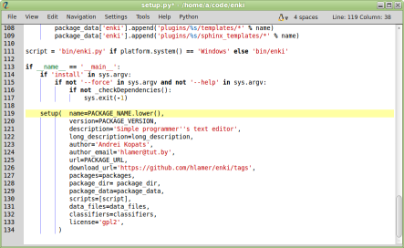
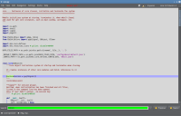
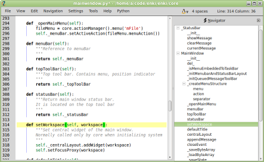
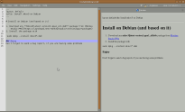
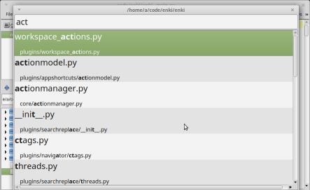
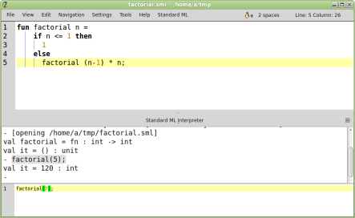
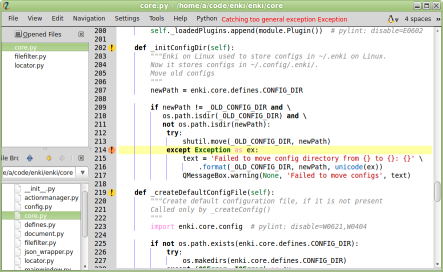
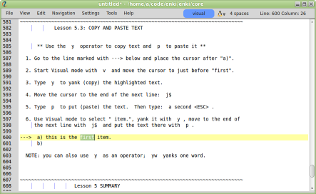

<h2>Enki is a text editor for programmers. It is:</h2>
<ul>
    <li><strong>User friendly.</strong> Intuitive interface. Works out of the box. You don&#8217;t have to read a lot of docs.</li>
    <li><strong>Hacker friendly.</strong> Work as quickly as possible. Navigate efficiently without your mouse.</li>
    <li><strong>Advanced.</strong> You invent software. An editor helps you focus on inventing, instead of fighting with your tools.</li>
    <li><strong>Extensible.</strong> Operating systems are designed for running applications. Enki is designed for running plugins.</li>
    <li><strong>Cross platform.</strong> Use your habitual editor on any OS. Tested on Linux and Windows. Users report that Enki works Mac OS X.</li>
    <li><strong>High quality.</strong> No long list of fancy features. But, what is done, is done well.</li>
    <li><strong>Open source.</strong> Created, tested, and designed for the community, by the community, and with the community.</li>
</ul>

<!-- Hiding social buttons
    

        

            <a href="https://twitter.com/EnkiEditor" class="twitter-follow-button" data-show-count="false" data-size="large" data-show-screen-name="false">Follow @EnkiEditor</a>
        

            

                
            

    

-->

    

        

            <a href="https://github.com/andreikop/enki/#installation" class="download-button">
                
                 
                Source package
            </a>

            <a href="http://software.opensuse.org/download.html?project=home%3Ahlamer%3Aenki&amp;package=enki" class="download-button">
                <table valign="center">
                    <tr>
                        <td>
                            
                        </td>
                        <td>
                            
                        </td>
                    </tr>
                    <tr>
                        <td>
                            
                        </td>
                        <td>
                            
                        </td>
                    </tr>
                </table>
                 
                Linux installer
            </a>

            <a href="http://github.com/andreikop/enki/releases" class="download-button">
                
                 
                Windows installer
            </a>

        

        <a href="./packaging.html" id="where-is">Where is the package for my OS?</a>

    

    

        <h2>News</h2>
        

            
            

                

                    {{ post.date | date_to_string }}
                

                

                    <a href="{{ page.baseurl }}{{ post.url }}">{{ post.title }}</a>
                

            

            
        

        

            <a href="archive.html">All news...</a>
        

    

    

    

    

        

             
            Truly Minimalistic UI
        

        

             
            Best-in-class search/replace functionality
        

    

    

        

             
            In-file navigation for 40+ languages
        

        

             
            Markdown, HTML, reStructuredText live preview
        

    

    

        

             
            Fuzzy file-matching and bash-like path completion
        

        

             
            REPL for Python, SML, Scheme
        

    

    

        

             
            Pylint support
        

        

             
            Vim mode
        

    

    <!-- Hiding More Screenshots link
        
<a href="#">More screenshots ...</a>

    -->

