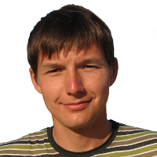

## Andrei Kopats

**hlamer**

[hlamer@tut.by](mailto:hlamer@tut.by)

Enki developer

## Filipe Azevedo
**PasNox**

  
[Monkey Studio](http://monkeystudio.org) founder, maintainer and the most active developer.
Guy, who knows Qt better, than its developers do.

## Evgeni Golov
**Zhenech**

  
Monkey Studio Debian packager.  
Our Debian guru.

## Jairo Llopis
**Yajo**

RPM spec author.
Fedora packager.

## Vitaly Shukela
Early adopter. The most active user.

Generaged huge amount of useful bug reports and feature ideas.
